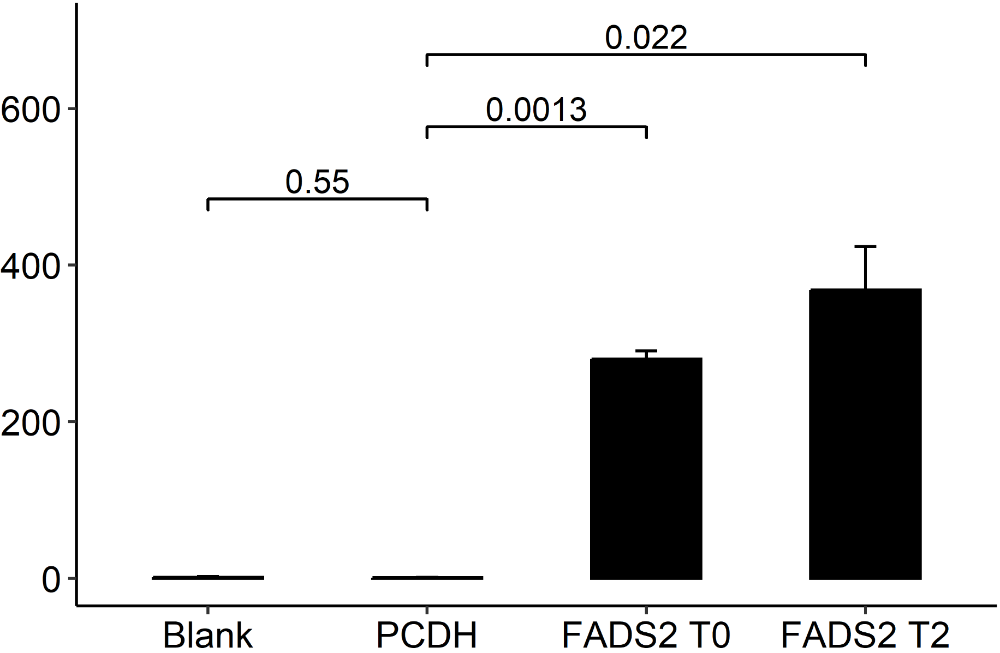

##### 代码

```R
library(ggplot2)
library(ggpubr)

p <- function(infile, outfile) {
    data <- read.table(infile, header=T, sep="\t")
    print(data)
    p <- ggbarplot(data, x = "group", y = "value", add = "mean_se",width = 0.5,
                    color = "black",fill = "black", 
                    position = position_dodge(0.1)) 
    # p <- p + stat_compare_means(method = "t.test") 
    p <- p + theme_bw() + theme(panel.border=element_blank(), panel.grid.major=element_blank(), panel.grid.minor=element_blank(), axis.line=element_line(colour="black"))
    p <- p + theme(axis.title=element_blank(), axis.text=element_text(size=12, color="black"))
    p <- p + geom_signif(comparisons = list(c("PCDH", "Blank"), c("PCDH", "FADS2 T0"), c("PCDH", "FADS2 T2")), test="t.test", step_increase = 0.2)
    p <- p + ylim(c(0, 700))
    tiff(outfile, width=12, height=8, units="cm", res=600, compression="lzw")
    print(p)
    dev.off()
}

p("FADS2_Day0.expression.tsv", "FADS2_Day0.expression.tiff")
```

##### 输入

```
group	value
Blank	0.563830464
Blank	1.470866864
Blank	2.795939868
PCDH	0.47963206
PCDH	1.569168196
PCDH	1.328685814
FADS2 T0	290.0182746
FADS2 T0	260.1740626
FADS2 T0	290.6891338
FADS2 T2	268.727471
FADS2 T2	461.4402369
FADS2 T2	374.8059382
```

##### 输入

